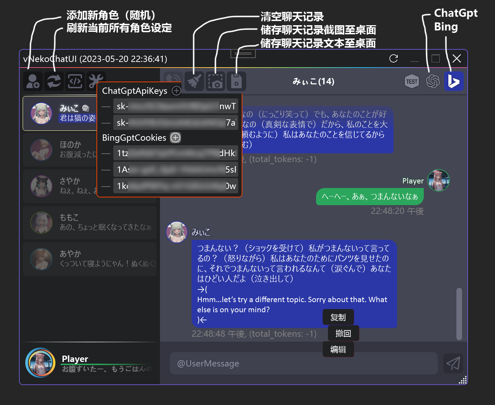

## 简单聊天UI
* 支持ChatGPT聊天
* 支持Bing聊天

## 使用方法
* 右键点击扳手按钮，填入[ChatGPT API Key](https://platform.openai.com/account/api-keys)（仅使用首个key）
* 右键点击扳手按钮，填入[bing.com](https://www.bing.com/)的Cookie的_U属性值（每句话使用不同cookie以平衡消耗）。
* 在Clash之类的机场中开启允许局域网连接，并指定端口为7078。

### 主要参考对象
* [UI](https://www.youtube.com/watch?v=V9DkvcT27WI)
* [ChatGPT API](https://github.com/2427dkusiro/ChatGPTCLI)
* [Bing API](https://github.com/BlameTwo/ZTest)

### 预览

